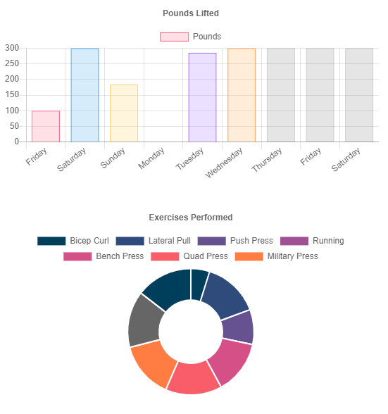
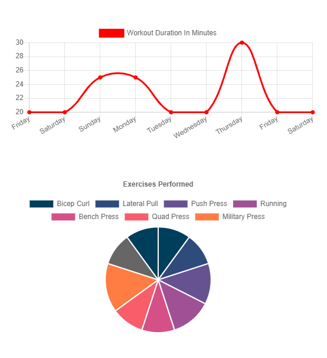

# parkers-antilazy
Workout app to track your minutes database and backend with given front end.

[Link to repository](https://github.com/MorgansPlayGames/parkers-antilazy)

[Live Website](https://parkers-antilazy.herokuapp.com/)

1. [ Description. ](#description)
2. [ Technology Used.](#technology-used)
2. [ Installation ](#installation-instructions)
3. [ Usage Information ](#usage-information)
4. [ Contribution Guidelines ](#contribution-guidelines)
5. [ Licence ](#licence)
6. [ Questions ](#questions?)

## Description:
    Mongo database to access workouts and subsequent exercises. 

## Technology Used
    JS
    Mongo
    Node:
        Express
        Mongoose
        Morgan

### Installation Instructions
    Have a Mongodb installed and running
    Download
    'npm install' to install dependancies.
    'npm run seed' to get a seed of info
    'npm start' or 'node server.js'  
 
### Usage Information
    On run, the webpage can be opened and a workout can be edited or created with excersises input.

### Contribution Guidelines
    Fork, update, and
    Submit your code to me!

### Licence 
    Copyright (c) 2020, Parker Morgan
    All rights reserved.
        
    This source code is licensed under the MIT-style license found in the
    LICENSE file in the root directory of this source tree.

### Questions?
    GitHub: MorgansPlayGames
    Email: jpmaster13@msn.com